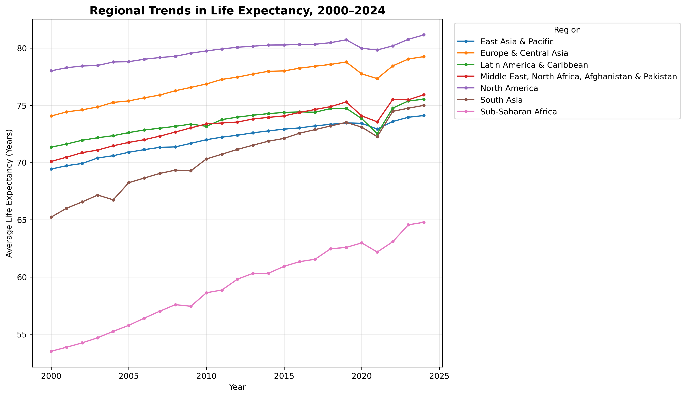
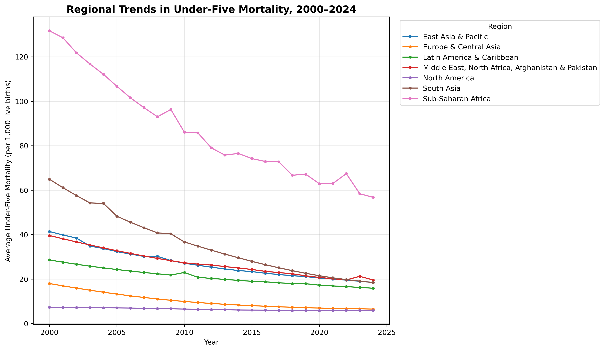
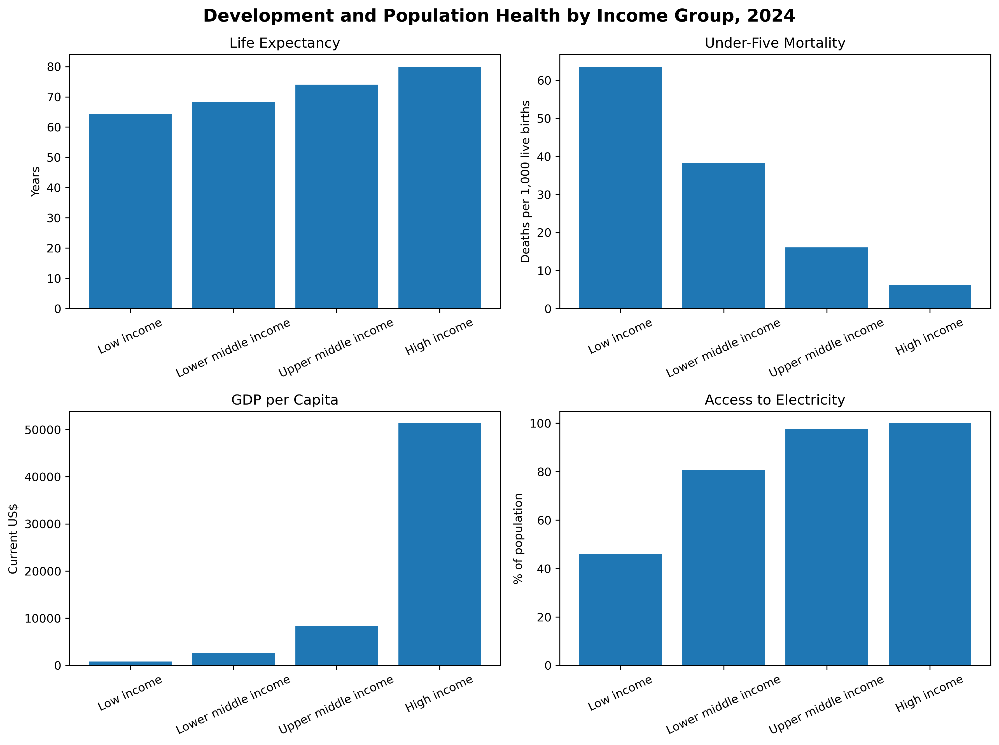
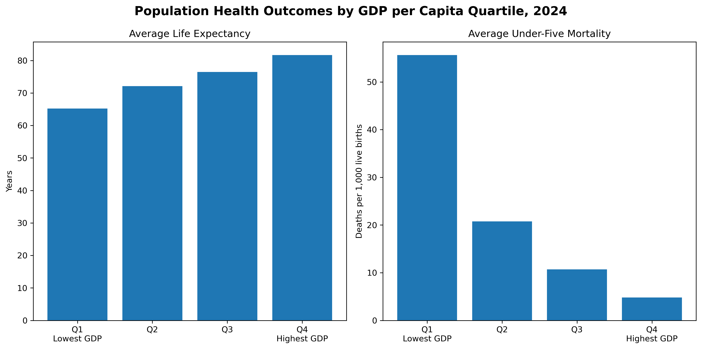
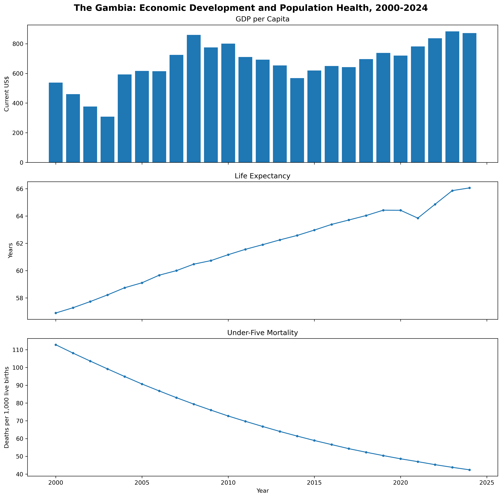

# Assessing Economic Development and Population Health Using SQL

## Overview

This project analyzes cross-country patterns in economic development and population health using World Bank World Development Indicators (WDI) from 2000–2024.

An end-to-end analytical workflow was developed using the World Bank API, Python, PostgreSQL, SQL, and Matplotlib. The analysis examines long-term trends, regional and income-group disparities, country-level improvements, and relationships between economic conditions, infrastructure, and population health.

## Objective

To assess cross-country patterns and trends in economic development and population health, focusing on changes over time, regional and income-group differences, and relationships among key development and health indicators.

## Research Questions

1. How have economic development and population health indicators changed over time?
2. How do development and health outcomes differ across regions and income groups?
3. Which countries experienced the greatest improvements?
4. What relationships exist between economic conditions, infrastructure, health investment, and population health?
5. Which lower-income countries achieve comparatively strong population-health outcomes?

## Data

**Source:** World Bank World Development Indicators  
**Study period:** 2000–2024  
**Coverage:** Individual countries/economies; World Bank aggregate groups were excluded.

### Indicators

- GDP per capita (current US$)
- GDP growth (annual %)
- Life expectancy at birth
- Under-five mortality rate
- Current health expenditure (% of GDP)
- Access to electricity (% of population)
- Population, total

## Workflow

```text
World Bank API
      ↓
Python
      ↓
CSV data
      ↓
PostgreSQL staging table
      ↓
Relational database
      ↓
SQL analysis
      ↓
Python / Matplotlib
      ↓
Results and visualizations
      ↓
Git version control
      ↓
GitHub repository
```

## Key Findings

- **Sub-Saharan Africa showed the strongest improvement in population health but continued to face the largest health disadvantage.** It recorded the largest regional increase in average life expectancy between 2000 and 2024, yet still had the lowest average life expectancy in 2024. North America's average life expectancy in 2000 was still more than 13 years higher than Sub-Saharan Africa's average in 2024.

- A similar pattern was observed for **under-five mortality**. Sub-Saharan Africa achieved the largest regional reduction between 2000 and 2024 but continued to have the highest under-five mortality rate among all regions in 2024.

- The country-level analysis reinforced this pattern: **all 15 countries with the largest increases in life expectancy and all 15 countries with the largest reductions in under-five mortality were in Sub-Saharan Africa**.

- Large economic disparities persisted. Sub-Saharan Africa's average GDP per capita increased from approximately **$952 in 2000 to $2,682 in 2024**, but remained the lowest among the regions. By comparison, North America's average GDP per capita was already approximately **$39,048 in 2000**.

- **South Asia recorded the largest improvement in electricity access**, increasing from **51.23% in 2000 to 99.55% in 2024**. Sub-Saharan Africa also improved substantially, from **27.72% to 58.23%**, but remained the region with the lowest average access.

- A clear **income-related development and health gradient** was observed in 2024. Average life expectancy increased from **64.41 years in low-income economies to 80.00 years in high-income economies**, while under-five mortality decreased from **63.62 to 6.24 deaths per 1,000 live births**.

- Population health also varied strongly across GDP-per-capita levels. Countries in the lowest GDP-per-capita quartile averaged **65.21 years** of life expectancy and **55.61 under-five deaths per 1,000 live births**, compared with **81.64 years** and **4.80 deaths per 1,000** in the highest quartile.

- Electricity access showed a similarly strong relationship with health outcomes. Countries with less than 50% electricity access averaged **62.00 years** of life expectancy and **75.55 under-five deaths per 1,000**, compared with **78.40 years** and **9.05 deaths per 1,000** among countries with universal electricity access.

- Health expenditure showed a less straightforward relationship with health outcomes. Outcomes generally improved across the first three expenditure quartiles, but countries in the highest health-expenditure quartile did not have the best average health outcomes, indicating that **health expenditure as a percentage of GDP alone does not fully explain population-health performance**.

- Several low- and lower-middle-income countries achieved comparatively favorable health outcomes relative to their economic peers, demonstrating that **economic position alone does not fully determine population-health outcomes**.

## Selected Visualizations

### Regional Life Expectancy Trends, 2000–2024



### Regional Under-Five Mortality Trends, 2000–2024



### Development and Population Health by Income Group, 2024



### Population Health Outcomes by GDP per Capita Quartile, 2024



### The Gambia: Economic Development and Population Health, 2000–2024




## Important Notes

GDP per capita is measured in current US dollars, so long-term changes represent nominal rather than purely real economic changes.

The relationships identified in this project are descriptive associations and should not be interpreted as causal effects.

Health-expenditure analysis used 2023 because cross-country coverage was substantially greater than in 2024.